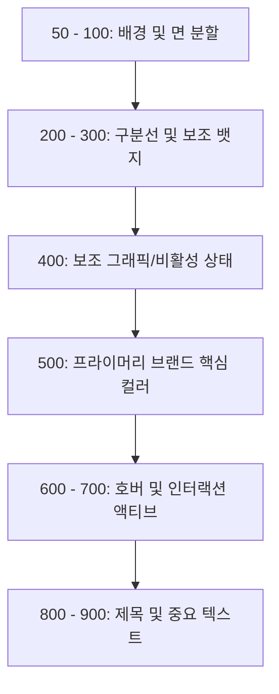

# OKLCH 컬러 & 무채색 제너레이터 도입 및 실무 활용 가이드

이 가이드는 교보 다솜케어와 같은 B2B 헬스케어 포털이나 화이트라벨 서비스 환경에서, 무한히 변화하는 브랜드 컬러에 맞춰 디자인 시스템을 빠르게 구축하고 웹 접근성을 자동으로 확보할 수 있도록 돕는 실무 활용 가이드입니다. 

"이 도구를 왜 만들었고, 실제 프로젝트에서 어떻게 사용하면 되는가"를 중심으로 기획자, 디자이너, 개발자 모두가 쉽게 읽을 수 있도록 작성되었습니다.

---

## 1. 왜 만들었는가 (Background)

교보 다솜케어와 같은 B2B 헬스케어 솔루션은 포털을 도입하는 **고객사마다 고유의 브랜드 컬러**를 시스템 전체에 반영해 주어야 합니다. 

새로운 고객사가 추가될 때마다 디자이너와 개발자는 매번 동일한 컬러 시스템 설계 및 검증 프로세스를 처음부터 반복해야 했습니다. 이 비효율적인 수동 작업을 **"단 하나의 브랜드 컬러 입력만으로 상용 레벨의 모든 스케일이 자동 설계되도록 만들자"**는 아이디어에서 본 제너레이터 패밀리가 탄생했습니다.

---

## 2. 어떤 문제를 해결하는가 (Problem & Solution)

기존의 수동 컬러 스케일 구축 방식은 크게 4가지 치명적인 문제를 안고 있었습니다.

- **문제 1. 브랜드 컬러 변경 시 스케일 재설계**: 메인 컬러가 바뀌면 그에 어울리는 10단계(50~900) 스케일을 일일이 눈으로 보며 다시 만들어야 했습니다.
- **문제 2. 다크 모드 컬러 재구성**: 눈이 편안한 다크 모드 전용 컬러 세트를 추출하려면 채도를 낮추고 명도를 뒤집는 별도의 연산 작업이 매번 필요했습니다.
- **문제 3. 무채색(Neutral) 그레이의 시각적 충돌**: 주 색상(Primary)이 쿨톤인데 무채색을 웜톤 그레이로 쓰면 전체 UI가 칙칙해 보입니다. 주 색상에 어울리는 그레이 톤을 매번 고민해 짝지어야 했습니다.
- **문제 4. 수동 웹 접근성(WCAG 2.1) 검증**: 색상이 바뀔 때마다 본문이나 버튼 위에 얹어질 글자색이 명암비 기준(PASS/FAIL)을 만족하는지 사이트에 일일이 HEX를 붙여넣어 확인해야 했습니다.

### 💡 본 제너레이터의 해결책
이 도구는 **브랜드 컬러 하나만 입력하면, 프라이머리 10단계 + 어울리는 무채색 10단계 + 라이트/다크 모드 전용 토큰 + 웹 접근성 합격 여부**를 단 1초 만에 자동으로 연산하여 완벽한 디자인 뼈대를 완성해 줍니다.

---

## 3. 실제 사용 방법 (Step-by-Step)

실무자가 제너레이터 화면에서 작업하는 흐름은 다음과 같이 매우 직관적입니다.

### **Step 1. 브랜드 Base Color 입력**
- 고객사의 브랜드 가이드라인에 명시된 대표 색상(예: Toss Blue `#3182F6`)의 HEX 코드를 입력창에 입력합니다.

### **Step 2. 채도 모드(Chroma Easing) 선택**
- 디자인 콘셉트에 맞게 채도 감쇄 모드를 선택합니다.
  - **Standard**: 생생하고 선명한 핀테크/커머스 서비스에 어울리는 강한 톤.
  - **Subtle**: 고급스럽고 차분한 대시보드나 백오피스 환경에 어울리는 부드러운 파스텔 톤.

### **Step 3. 무채색(Neutral) 자동 추천 및 조율**
- 입력한 브랜드 컬러와 최적의 대비를 이루는 그레이 톤(Slate, Cool, Neutral, Warm 중 하나)이 **오토 페어링 엔진**에 의해 자동 제안됩니다. 필요시 드롭다운에서 수동으로 오버라이드할 수도 있습니다.
- 무채색 제너레이터 슬라이더를 통해 명도의 한계값(가장 밝은 단계 `Max L`과 가장 어두운 단계 `Min L`)을 미세 조율합니다.

### **Step 4. Light / Dark 테마 교차 검증**
- 테마 토글 스위치(Light/Dark)를 클릭하여 화면 상에서 10단계 그라데이션 명암이 왜곡 없이 부드럽게 반전되는지 시각적으로 검증합니다.

### **Step 5. Figma Variables 및 CSS 변수 내보내기**
- 화면 우측 하단의 개발자 익스포트 패널에서 **[Copy Light/Dark JSON]** 버튼 또는 **[Download Light/Dark (.json)]** 버튼을 눌러 피그마용 토큰 파일을 챙기고, 퍼블리싱을 위한 **[CSS Properties]** 코드를 복사합니다.

---

## 4. 디자인 시스템 적용 방법 (Integration)

제너레이터에서 가공한 토큰 데이터를 실제 실무에 이식하는 가이드입니다.

### 🎨 Figma 디자인 환경에 적용하기
1. 무채색 및 메인 제너레이터 하단에서 각각 **Light/Dark JSON** 파일을 다운로드합니다.
2. 피그마에서 `Variables Import` 플러그인을 실행합니다.
3. 다운로드받은 파일을 불러와 단일 컬렉션(Collection) 내에 **'Light' 모드**와 **'Dark' 모드** 컬럼으로 나란히 바인딩합니다.
4. 프레임이나 컴포넌트를 디자인할 때 테두리, 배경, 텍스트에 연동된 Variable 토큰을 매핑하면, 피그마 우측의 모드 전환 아이콘 클릭 한 번으로 라이트/다크 디자인이 즉시 스위칭됩니다.

### 💻 Web 개발 환경에 적용하기
복사한 CSS Properties 코드를 프로젝트 글로벌 스타일시트(`global.css`)에 이식합니다.

```css
/* 기본 상태 (라이트 모드) */
:root {
  --base-color: oklch(60.1% 0.198 253.8);
  --color-50: oklch(95.1% 0.030 252.1);
  --color-500: oklch(60.1% 0.198 253.8); /* 브랜드 메인 컬러 */
  --color-900: oklch(20.1% 0.119 255.4);
}

/* 다크 모드 활성화 상태 */
[data-theme="dark"] {
  --base-color: oklch(60.1% 0.198 253.8);
  --color-50: oklch(20.1% 0.022 255.4);   /* 어두운 배경으로 반전 */
  --color-500: oklch(60.1% 0.149 253.8);  /* 채도가 25% 보정된 메인 컬러 */
  --color-900: oklch(95.1% 0.149 252.1);  /* 밝은 글자색으로 반전 */
}
```

---

## 5. 컬러 스케일 활용 가이드 (Component Mapping)

생성된 50~900단계 컬러 토큰을 실제 웹/앱 화면에 배치할 때 권장하는 디자인 레이아웃 매핑 기준입니다.



### 💡 UI 컴포넌트 적용 매트릭스

* **`50 ~ 100` : Background & Dividers**
  - **50단계**: 레이아웃 전체 배경, 정보 카드의 소프트한 배경, 토스트 알림 메시지 배경.
  - **100단계**: 입력창(Input Box)의 배경, 테이블 행(Row) 구분선, 비활성 버튼의 기본 배경.
* **`200 ~ 300` : Borders & Surfaces**
  - **200단계**: 입력창의 아웃라인 Border, 태그(Tag)나 뱃지(Badge)의 배경 플레이트.
  - **300단계**: 아웃라인 버튼의 경계선, 마우스 호버(Hover) 시 나타나는 영역 힌트 배경.
* **`400` : Secondary UI**
  - **400단계**: 액티브 탭 바의 하단 라인, 보조 아이콘, 일러스트레이션 그래픽 요소.
* **`500` : Brand Primary (시그니처)**
  - **500단계**: 가장 눈에 띄어야 하는 '프라이머리(제출/확인) 버튼' 배경색, 중요 상태 표시 뱃지.
* **`600 ~ 700` : Interaction Active**
  - **600단계**: 프라이머리 버튼을 마우스로 가리켰을 때(Hover)나 눌렀을 때(Active) 변하는 강조 컬러.
  - **700단계**: 텍스트 링크 컬러, 중요한 서브 텍스트 버튼 글자색.
* **`800 ~ 900` : Typography (글자)**
  - **800단계**: 부제목(H3), 정보 레이블 텍스트, 보조 본문 카피.
  - **900단계**: 페이지 타이틀(H1, H2), 메인 본문(Body) 글자색.

---

## 6. 설계 철학 및 기술적 배경 (Design Philosophy)

이 도구가 디자인 완성도와 눈의 편안함을 보장할 수 있는 정교한 기술적 설계 배경입니다.

### ① OKLCH 색공간의 지각적 균일성
- sRGB 공간의 명도 계산 오류를 완벽히 해결하여, 어떤 색조(Hue) 대역이 들어오더라도 모니터 화면에서 느껴지는 시각적 밝기 차이(Contrast)가 일정하게 보정됩니다.

### ② 지능형 색상 이동 (Hue Shifting)
- 색상이 어두워질 때 단순히 검은색을 섞지 않고, 자연광의 원리에 기반하여 색상각을 미세하게 조정(예: 파란색이 어두워질 때 보랏빛 네이비로, 노란색이 어두워질 때 붉은 갈색으로 시프트)하여 맑고 신선한 톤을 지켜냅니다.

### ③ 적응형 채도 감쇄 (Chroma Curve)
- 명도가 최고조에 달하거나(50) 최저조로 떨어질 때(900) 발생하기 쉬운 채도 찢어짐(형광빛 현상)을 미연에 방지하기 위해, 단계별로 최적의 비율로 채도를 감쇄하는 Easing 곡선이 내장되어 있습니다.

### ④ 다크 모드 대칭 반전 (Symmetric Inversion)
- 다크 모드 스케일 생성 시, 라이트 모드의 50~900단계 배열을 완벽히 복제하여 순서만 역순으로 덮어씌웁니다. 이 과정에서 얕은 복사로 인한 데이터 오염을 차단하여 500단계 부근의 명도가 데칼코마니처럼 뭉개지는 팰린드롬 오류를 원천 차단했습니다.

### ⑤ Gamut clipping & True Neutral 붕괴 방지
- sRGB 한계치를 넘는 파란색 등에서 임포트가 실패하는 것을 방지하기 위해 R/G/B 값을 `0`과 `1` 사이로 완벽히 클램핑하며, True Neutral(Chroma=0)일 때 일어나는 `NaN` Hue 연산 붕괴를 강제 `0` 치환으로 방어합니다.

---

## 7. 기대 효과 및 활용 범위 (Business Impact)

- **디자인/개발 공수 90% 이상 절감**: 도입사(테마)가 추가될 때마다 며칠씩 소요되던 팔레트 컬러 매핑 및 퍼블리싱 소스코딩 시간이 단 수초로 단축됩니다.
- **웹 접근성 즉시 충족**: 별도의 수동 대비율 계산을 거치지 않아도 자동으로 WCAG 2.1 접근성 가이드라인을 통과하는 디자인 결과물을 신뢰하고 배포할 수 있습니다.
- **플랫폼 확장성 확보**: 교보 다솜케어뿐만 아니라 향후 개발될 모든 화이트라벨 패키지 솔루션 및 다양한 도메인의 SaaS 브랜드 테마 커스터마이징 표준 플랫폼으로 범용 활용이 가능합니다.
